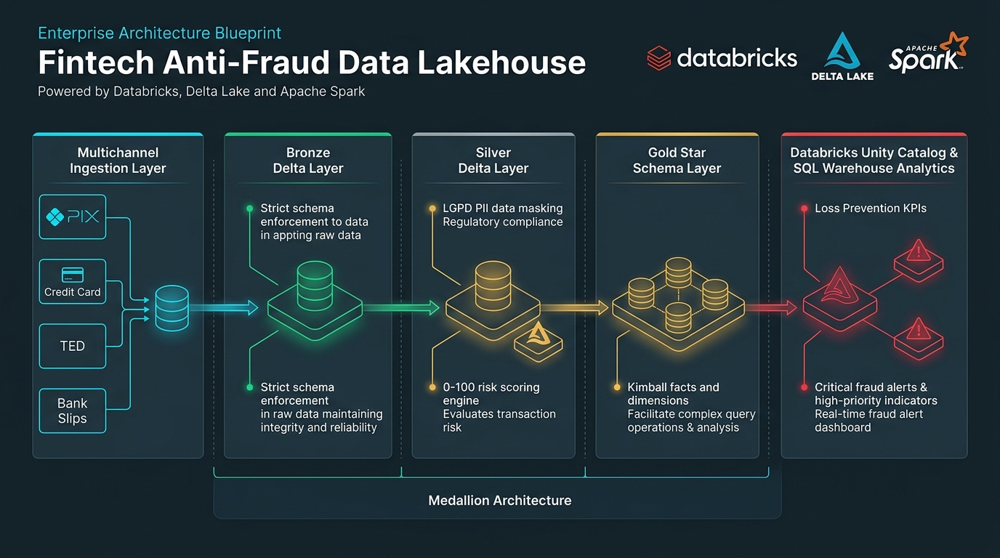
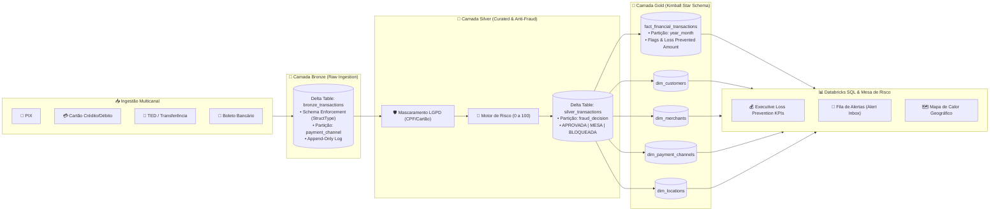

<div align="center">

# 💳 Fintech Anti-Fraud Data Lakehouse & Loss Prevention
### Arquitetura Medalhão Corporativa em Databricks, Delta Lake, PySpark & Unity Catalog

[](https://www.python.org/)
[](https://spark.apache.org/)
[](https://delta.io/)
[](https://databricks.com/)
[](https://www.databricks.com/product/unity-catalog)
[](https://pytest.org/)
[](https://www.gov.br/cidadania/pt-br/acesso-a-informacao/lgpd)

<br/>



</div>

---

## 📌 1. Visão Executiva & Contexto de Negócio

No setor bancário e em fintechs modernas (*digital banking* e processadoras de pagamento), transações fraudulentas causam bilhões de reais em perdas anuais (*chargebacks* e prejuízos operacionais).

Este projeto implementa um **Data Lakehouse Corporativo de Prevenção a Fraudes e Análise de Risco Financeiro**, combinando ingestão multicanal em tempo quase-real, governança e conformidade com a **LGPD (Lei Geral de Proteção de Dados)**, um motor de **Score de Risco (0 a 100)** e modelagem dimensional **Kimball Star Schema** no **Databricks com Unity Catalog**.

### 🎯 Principais Objetivos Alcançados:
- **Prevenção a Perdas Financeiras:** Identificação e bloqueio automático de transações de alto risco.
- **Governança LGPD:** Anonimização e mascaramento irreversível de dados sensíveis (CPF e Número do Cartão).
- **Mesa de Análise de Risco (Alert Inbox):** Fila priorizada por score para auditoria manual de analistas.
- **Modelagem Dimensional Kimball:** Tabelas Fato e Dimensões otimizadas para consultas analíticas em alta velocidade.

---

## 🏗️ 2. Arquitetura da Solução (Medallion Architecture)

O pipeline foi desenhado segundo a **Arquitetura Medalhão (Bronze ➔ Silver ➔ Gold)**:



---

## 🛡️ 3. Governança e Mascaramento LGPD (Camada Silver)

Para garantir conformidade estrita com a **Lei Geral de Proteção de Dados (LGPD)** e normas do Banco Central, a Camada Silver elimina o armazenamento de dados sensíveis (*PII - Personally Identifiable Information*):

| Dado Sensível Original | Regra de Mascaramento Aplicada | Exemplo Mascarado | Status LGPD |
| :--- | :--- | :--- | :--- |
| **CPF do Cliente** | Preserva apenas dígitos centrais com prefixo e sufixo ofuscados | `***.456.789-**` | ✅ Em Conformidade |
| **Número do Cartão** | Preserva apenas os 4 últimos dígitos (Truncamento PCI-DSS) | `****-****-****-9876` | ✅ Em Conformidade |
| **Canais Diretos (PIX/TED)** | Cartão não aplicável | `N/A_CANAL_DIRETO` | ✅ Tratamento de Nulos |

```python
# Transformação Nativa PySpark aplicada na Silver:
df_governance = df_dedup.withColumn(
    "masked_cpf",
    concat(lit("***."), substring(col("customer_cpf"), 5, 7), lit("-**"))
).withColumn(
    "masked_card_number",
    when(
        col("card_number").isNotNull(),
        concat(lit("****-****-****-"), substring(col("card_number"), -4, 4))
    ).otherwise(lit("N/A_CANAL_DIRETO"))
).drop("customer_cpf", "card_number")
```

---

## 🧠 4. Motor de Score de Risco e Matriz de Decisão

O motor avalia o comportamento transacional através de **4 vetores de anomalia ponderados**:

```text
Score de Risco = (is_night_time * 25) + (is_high_risk_category * 35) + (is_high_amount * 30) + (is_suspicious_device * 10)
```

### Matriz de Pesos e Critérios:
| Vetor de Risco | Condição Técnica | Peso |
| :--- | :--- | :---: |
| **Horário Noturno** | Transações realizadas entre **01:00 e 04:59 da madrugada** | **+25 pts** |
| **Categoria de Alto Risco** | Estabelecimentos de **Criptoativos P2P** ou **Apostas & Cassinos Online** | **+35 pts** |
| **Valor Anômalo** | Transações acima de **R$ 3.000,00** | **+30 pts** |
| **Dispositivo Desconhecido** | Dispositivos com hash suspeito (`DEV-SUSPECT-*`) | **+10 pts** |

### Classificação Anti-Fraude:
- 🟢 **`APROVADA` (Score < 35):** Transação legítima liberada instantaneamente.
- 🟡 **`ANALISE_MANUAL_MESA` (Score 35 a 64):** Transação enviada para fila de auditoria humana.
- 🔴 **`BLOQUEADA_SUSPEITA_FRAUDE` (Score >= 65):** Transação bloqueada na origem para prevenção de perdas.

---

## 🥇 5. Modelagem Dimensional Kimball (Camada Gold)

A Camada Gold estrutura os dados no formato **Star Schema** para consultas OLAP de alta performance:

```text
                            ┌────────────────────────┐
                            │     dim_customers      │
                            ├────────────────────────┤
                            │ customer_id (PK)       │
                            │ customer_name          │
                            │ masked_cpf             │
                            └───────────┬────────────┘
                                        │ 1:N
┌──────────────────────┐                │                ┌──────────────────────┐
│    dim_merchants     │                ▼                │ dim_payment_channels │
├──────────────────────┤    ┌───────────────────────┐    ├──────────────────────┤
│ merchant_name (PK)   ├───►│fact_financial_trans...│◄───┤ payment_channel (PK) │
│ merchant_category    │ 1:N├───────────────────────┤ 1:N└──────────────────────┘
└──────────────────────┘    │ transaction_id (PK)   │    
                            │ customer_id (FK)      │    
                            │ merchant_name (FK)    │    ┌──────────────────────┐
                            │ payment_channel (FK)  │    │    dim_locations     │
                            │ transaction_amount    │1:N ├──────────────────────┤
                            │ risk_score            ├───►│ transaction_city(PK) │
                            │ fraud_decision        │    │ transaction_state(PK)│
                            │ is_blocked_fraud      │    │ macro_region         │
                            │ loss_prevented_amount │    └──────────────────────┘
                            │ year_month (Partition)│
                            └───────────────────────┘
```

---

## 📊 6. Resultados Reais da Execução no Databricks

Execução e auditoria analítica realizada no **Databricks Serverless** sobre 1.000 transações financeiras:

### 📈 KPI Executivo de Prevenção a Perdas (Loss Prevention):
| Métrica Analítica | Valor Consolidado |
| :--- | :---: |
| **Volume Financeiro Total Transacionado** | **R$ 1.437.791,85** |
| **Total de Transações Processadas** | **1.000** |
| **Tentativas de Fraude Bloqueadas** | **53 transações** |
| 💰 **Total de Prejuízo Evitado (Loss Prevention)** | **R$ 537.568,61** |
| **Taxa Geral de Fraude** | **5,3%** |

### 🚨 Insights Críticos de Risco:
1. **Concentração em Criptoativos e Apostas:** As categorias *Criptoativos & Investimentos P2P* (R$ 250.804,64) e *Apostas & Cassinos Online* (R$ 192.126,55) concentraram **81,0% de todo o prejuízo evitado** da fintech.
2. **Distribuição por Canal:** O canal **Boleto Bancário** liderou em valor bloqueado (R$ 126.986,27), seguido por **Cartão de Crédito** (R$ 122.727,02) e **Cartão de Débito** (R$ 118.245,48).
3. **Concentração Geográfica:** A região **Sudeste (SP, MG, RJ)** concentrou **49,7%** do montante bloqueado em fraudes (R$ 267.176,33).

---

## 🧪 7. Qualidade de Dados & Testes Unitários (Pytest)

A suíte de testes unitários foi implementada utilizando o **Padrão AAA (Arrange, Act, Assert)** para isolar o motor de transformação:

```bash
pytest tests/test_silver.py -v
```

```text
============================= test session starts ==============================
platform linux -- Python 3.10+ / PySpark 3.5.0 -- pytest-8.3.4
collected 3 items

tests/test_silver.py::test_silver_lgpd_data_masking PASSED               [ 33%]
tests/test_silver.py::test_silver_fraud_blocking_logic PASSED            [ 66%]
tests/test_silver.py::test_silver_legitimate_transaction_approval PASSED [100%]

============================== 3 passed in 19.97s ===============================
```

---

## 🚀 8. Estrutura do Projeto & Como Executar

### 📂 Estrutura de Diretórios:
```text
fintech-fraud-detection-databricks/
├── docs/
│   └── assets/
│       └── architecture_blueprint.png  # Blueprint de Arquitetura Oficial
├── notebooks/                          # Suíte de Notebooks Databricks
│   ├── 01_bronze_ingestion.py          # Ingestão Bronze & Schema Enforcement
│   ├── 02_silver_fraud_detection.py    # Curadoria Silver, LGPD & Motor de Risco
│   ├── 03_gold_star_schema.py          # Modelagem Gold Kimball Star Schema
│   ├── 04_unity_catalog_governance.sql # Scripts de Governança e RBAC
│   └── 05_fraud_analytics_queries.sql  # Consultas Executivas Databricks SQL
├── src/                                # Módulos Python Reutilizáveis
│   ├── __init__.py
│   ├── bronze.py                       # Ingestão e Faker Generator
│   ├── silver.py                       # Transformações Silver & Risco
│   └── gold.py                         # Modelagem Fato e Dimensões
├── tests/
│   ├── __init__.py
│   └── test_silver.py                  # Testes Unitários Pytest (Padrão AAA)
├── main.py                             # Orquestrador Local do Pipeline
├── requirements.txt                    # Dependências do Projeto
└── README.md                           # Documentação Corporativa
```

### 💻 Executando Localmente:
```bash
# 1. Clonar o repositório
git clone https://github.com/loweri/fintech-fraud-detection-databricks.git
cd fintech-fraud-detection-databricks

# 2. Criar e ativar o ambiente virtual
python3 -m venv .venv
source .venv/bin/activate

# 3. Instalar dependências
pip install -r requirements.txt

# 4. Rodar a esteira completa
python main.py

# 5. Executar os testes unitários
pytest tests/ -v
```

### ☁️ Executando no Databricks:
1. Conecte o repositório via **Databricks Git Folders** (`https://github.com/loweri/fintech-fraud-detection-databricks`).
2. Abra a pasta `notebooks/` e execute sequencialmente:
   - `01_bronze_ingestion` ➔ `02_silver_fraud_detection` ➔ `03_gold_star_schema` ➔ `05_fraud_analytics_queries`.

---

## 👨‍💻 Autor

**Ericles Fernandes Oliveira**  
*Data Engineer | Analytics Engineering & Cloud Data Architectures*  
🔗 [LinkedIn](https://www.linkedin.com/in/ericlesoliveira/) • 🐙 [GitHub](https://github.com/loweri) • 📧 [E-mail](mailto:ericlesg@proton.me)
